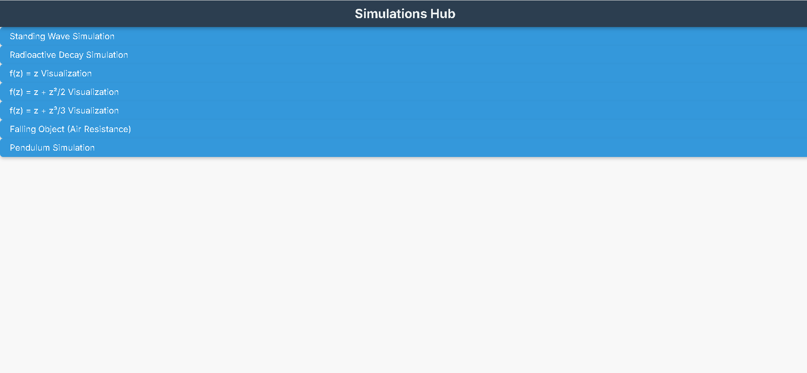

# Three.js Practical Training



This project is a collection of interactive physics and mathematical simulations built using **Three.js** and **JSXGraph**. It serves as a practical training ground for visualizing scientific concepts and implementing numerical methods in a web environment.

## Project Structure

The project is structured to separate different simulations into their own files.
(```)

/threejspractical-training
├── dist/                # Output of the build process
├── node_modules/        # Project dependencies
├── public/              # Static assets
├── src/
│   ├── textures/        # Image textures for Three.js
│   ├── complex_z.js     # Complex function visualization (f(z) = z)
│   ├── complex_z2.js    # Complex function visualization (f(z) = z + z²/2)
│   ├── complex_z3.js    # Complex function visualization (f(z) = z + z³/3)
│   ├── decay.js         # Radioactive decay simulation
│   ├── falling_object.js # Falling object physics simulation
│   ├── main.js          # Standing waves on a string visualization
│   └── pendulum.js      # Simple pendulum simulation
├── .gitignore           # Git ignore file
├── complex_z.html       # HTML for complex_z.js
├── complex_z2.html      # HTML for complex_z2.js
├── complex_z3.html      # HTML for complex_z3.html
├── decay.html           # HTML for decay.js
├── falling_object.html  # HTML for falling_object.js
├── index.html           # Main entry point (can be a directory listing or a showcase)
├── package-lock.json    # Dependency tree
├── package.json         # Project metadata and scripts
└── vite.config.js       # Vite configuration file

(```)
## Features

This repository includes several distinct simulations, each demonstrating a different concept.

### 1. Complex Function Visualizations
Located in `complex_z.js`, `complex_z2.js`, and `complex_z3.js`. These files use **JSXGraph** to plot the transformation of a unit circle under different complex functions. This is a great way to visualize how functions map the complex plane.

* **`f(z) = z`**: Plots the identity transformation.
* **`f(z) = z + z²/2`**: Distorts the circle into a cardioid-like shape.
* **`f(z) = z + z³/3`**: Distorts the circle into a three-lobed shape.

### 2. Radioactive Decay Simulation
Located in `decay.js`. This simulation uses **Three.js** to model the random decay of particles. It also integrates **Chart.js** to display the decay curve in real time, demonstrating the exponential nature of radioactive decay.

* **Controls**: Adjust the decay constant (λ) and initial particle count.
* **Visualization**: Particles fade away as they decay.
* **Analysis**: Real-time chart displays the number of remaining particles over time.

### 3. Falling Object Simulation
Located in `falling_object.js`. This simulation models the physics of a falling object with interactive controls. It's a great demonstration of applying numerical integration methods in a 3D environment.

* **Physics**: Includes gravity, air resistance (drag), and wind force.
* **Integration**: Allows switching between **Euler integration** and **Verlet integration** to compare their stability and accuracy.
* **Interactivity**: Change the object's mass, size, initial velocity, and shape (sphere or cube) to see the effects.

### 4. Simple Pendulum Simulation
Located in `pendulum.js`. This simulation visualizes the simple harmonic motion of a pendulum in 3D using **Three.js**.

* **Controls**: Adjust the pendulum's length, gravity, and initial angle.
* **Physics**: The motion is calculated using a standard pendulum equation with Euler integration.
* **Interactivity**: Use OrbitControls to view the simulation from different angles.

### 5. Standing Waves on a String
Located in `main.js`. This simulation visualizes multiple standing waves. It's a great tool for understanding wave superposition and harmonics.

* **Visualization**: Multiple strings are animated with sine waves.
* **Controls**: Adjust the amplitude, frequency, and number of harmonics for each string in real time using a **dat.gui** control panel.
* **Physics**: The wave motion is calculated using the standing wave equation $y(x, t) = A \sin(kx) \cos(\omega t)$.
* **Dynamic Color**: The color of each string changes based on its current amplitude.

## Getting Started

To run this project, you need to have Node.js and npm (or yarn) installed.

1.  **Clone the repository:**
    ```bash
    git clone [https://github.com/shyamharsh/conformalmapping-physics-simulation.git](https://github.com/shyamharsh/conformalmapping-physics-simulation.git)
    cd threejspractical-training
    ```

2.  **Install dependencies:**
    ```bash
    npm install
    ```

3.  **Run the development server:**
    ```bash
    npm run dev
    ```

This will start a local server at `http://localhost:5173` (or another port). You can then navigate to the specific HTML files (e.g., `http://localhost:5173/falling_object.html`) to view each simulation.

## Live Demo

[]([https://YOUR_PROJECT_NAME.vercel.app](https://conformalmapping-physics-s-git-2ff597-shyamas-projects-fd612b59.vercel.app/index.html)

## License

This project is open-sourced under the MIT License.
